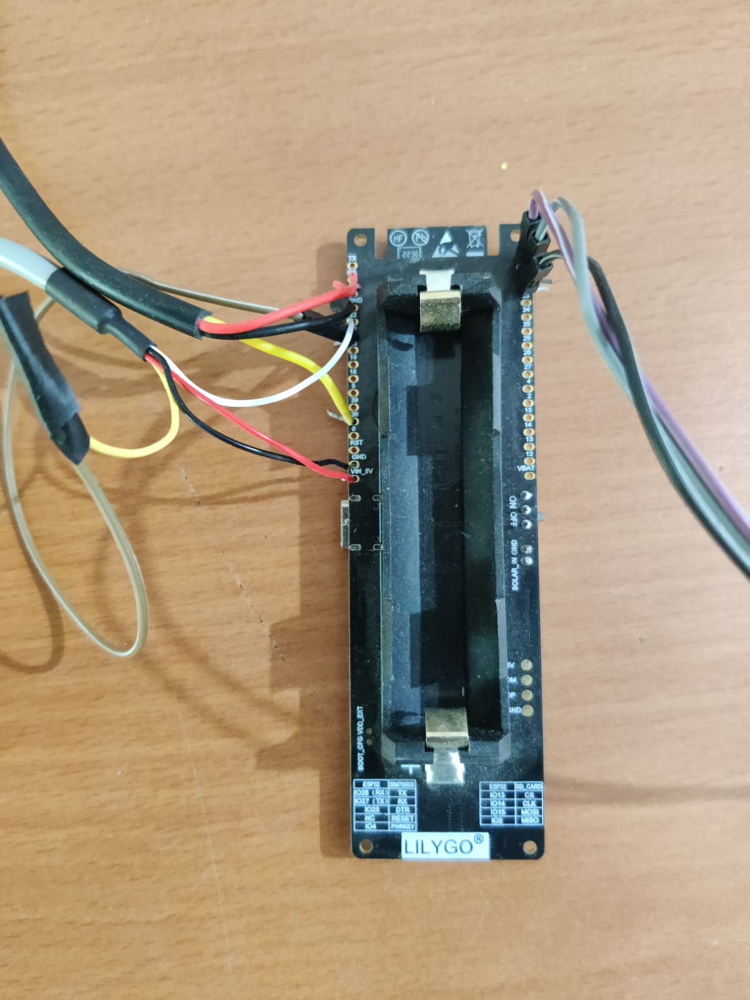

# Setup User and Its Device

## Create User
1. Login with Admin id: admin@iot.com, pass: 12345678.
2. Go to `User Management -> Add User`.
3. Fill up user details and generate device id (Store that id).
4. If you have not set up Arduino, then visit the [Arduino IDE Setup Guide and Tsim-A7670 Pin Setup](#arduino-ide-setup-guide-and-tsim-a7670-pin-setup) section.

---

## Arduino IDE Setup Guide and Tsim-A7670 Pin Setup 

### Arduino Setup
1. Documentation for Tsim-A7670 [T-A76XX repository](https://github.com/Xinyuan-LilyGO/LilyGO-T-A76XX/tree/main).
2. Open Arduino IDE.
3. Navigate to Arduino -> Preferences.
4. Add the following URLs to the "Additional Boards Manager URLs":
   - http://arduino.esp8266.com/stable/package_esp8266com_index.json
   - https://raw.githubusercontent.com/espressif/arduino-esp32/gh-pages/package_esp32_index.json
5. Click OK to close the Preferences window.
6. Go to Tools -> Board -> Boards Manager.
7. Search for "esp8266" and install the package.
8. Search for "esp32" and install the package.
9. Select "ESP32 Wrover Module" as the target board for code upload.
10. Upload the code from the Hardware Code Folder.

### Sensor Pins Configuration

#### Soil Moisture Sensor
- Pin: A0 (Analog Pin 0)
  - Connect the Soil Moisture Sensor analog output to Pin A0 on the Arduino.

#### Pressure Sensor
- Pin: A1 (Analog Pin 1)
  - Connect the Pressure Sensor analog output to Pin A1 on the Arduino.

#### AHTX0 Temperature and Humidity Sensor
- Connect the AHTX0 sensor to the default I2C pins:
  - SDA: 21
  - SCL: 22

## Server Code Setup
1. Clone the Repo.
2. Update the necessary configurations in the server code.
3. Run the server code to initiate the communication.

---
